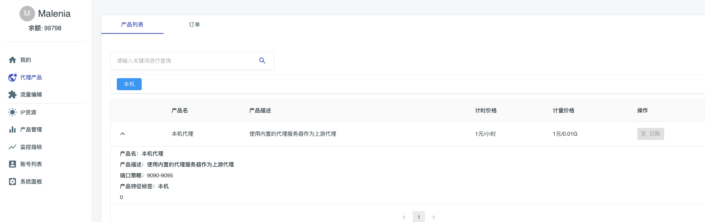
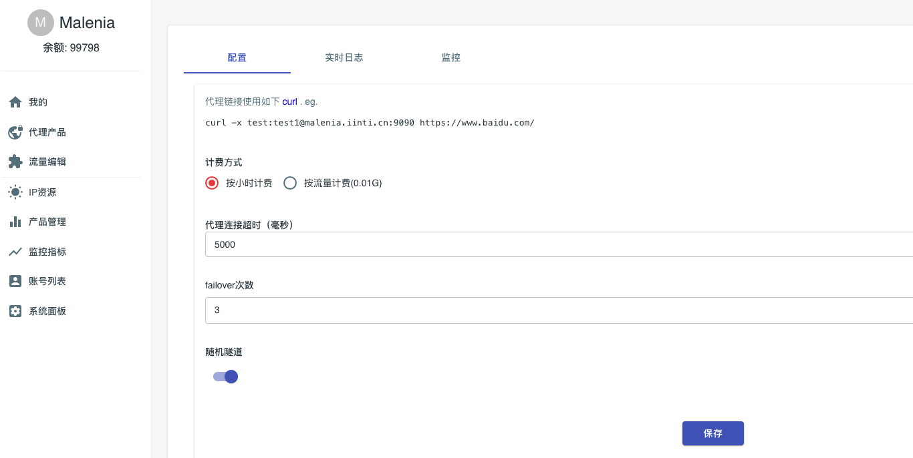
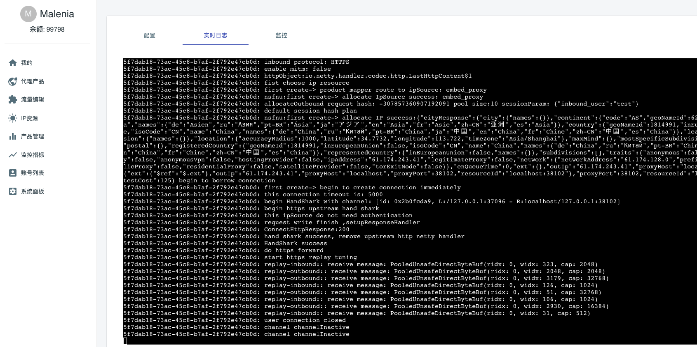
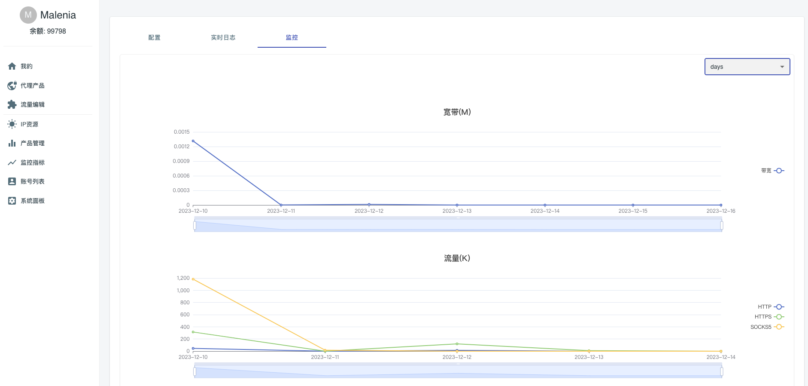

# 代理产品

代理产品是Malenia提供的代理服务组合。不同的Product可能拥有不同的特性，
如支持的国家/地区、支持的运营商、ip空间范围、ip质量、ip类型（机房、家庭、手机等）。那么由于属性不同，适用的业务场景也定价也会不同。

## 1.产品选择

在[代理产品首页](/index.html#/proxy)可以看到Malenia系统目前已经完成接入的所有产品。

- 你可以根据关键字搜索感兴趣的代理产品
- 你可以根据tag直接过滤你感兴趣的代理产品
- 当你选购了某个产品，则对应产品将会出现在您的订单页面

## 2.产品购买

在产品上面点击``选购``按钮，即可购买对应产品。目前产品有两种计费模式：

- 按小时计费： 每个小时进行一次扣费，直到账户余额被扣光
- 按流量计费： 价格单位为0.01G，按照对应价格扣除费用。按需使用，没有使用的时候不会扣费
  Malenia计费基于预充值模式，按时计费在小时级别进行费用扣除。按流量计费模式将会实时扣费，请保证账户账户余额充足。

## 3.接入代理产品

由于malenia的代理是按照标准支持的，所以您只需要知道``账号密码``、``代理服务器的ip和端口``即可接入代理服务

- 其中账号密码相关设定，请阅读下一章节内容。
- 代理服务器的ip，即为malenia服务器地址
- 代理服务器的端口，是一个端口范围，他在产品详情描述的``端口策略``字段中被展现。
- 如：``端口策略：22225``证明该产品的服务端口为:``22225``
- 如：``端口策略：25100-25110``证明该产品的服务端口为25100-25110之间的任意端口。

### 3.1 订单参数配置

你可以定义对于你的业务更加合适的代理使用参数

| 配置项        | 含义                                                                                                                                                                     | 默认值  |
|------------|------------------------------------------------------------------------------------------------------------------------------------------------------------------------|------|
| 随机隧道       | 开启随机隧道以后，每个请求都会随机ip出口，而不是保持每个端口一段时间的固定ip，随机隧道开启后你可以获得更多的ip出口资源                                                                                                         | 关闭   |
| failover次数 | 容错路由尝试次数，如果在整个代理隧道建立过程中发生了代理通道建立失败，malenia系统将会给你的请求替换代理尝试。这个重试过程是无状态的。在重试过程malenia会使用多ip并发尝试的方法尽可能保证代理请求成功，并且malenia将会记住路由session，尝试成功的ip将会替代本身路由映射ip，不会导致重试之后ip变成随机ip | 默认3次 |
| 代理连接超时     | 这是malenia连接上游ip资源，并完成上游ip资源鉴权整个过程的超时时间，如果超时单次代理连接建立将会扭转为失败，然后进入failover流程。请注意你的客户端的请求超时时间配置应该为： clientConnectTimeout > maleniaConnectTimeout *failoverCount            | 默认5秒 |
| 计费方式       | 你可以选择按小时或者按流量两种方式计费                                                                                                                                                    | -    |
| 带宽限制       | 需要联系管理员调整带宽限制，你不可以有权限调整他                                                                                                                                               | -    |

### 3.2 订单日志

系统将会为每一个订单创建一个订单日志空间，你可以在实时日志页面查看代理的全流程日志，这对于代理协议底层的发生流程的问题排查有很大作用。

### 3.3 订单监控

你可以在订单监控页面看到当前订单的访问情况监控，包括协议、量级、流量等。

