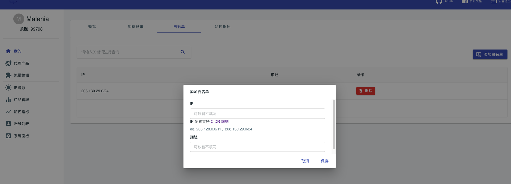

# 代理鉴权

malenia支持标准的socks5、http、https鉴权方案，同时Malenia支持快速的基于ip白名单的鉴权方案。用于提供灵活的代理接入方案。

## 账号密码鉴权

账号密码完全实现了代理ip的协议，对于任意标准的http客户端，都可以按照他的标准协议实现鉴权。你可以在网站后台设置自己的鉴权账户密码。

这里需要特殊说明，对于malenia系统，存在两个账密体系，分别为：

1. 后台账户：用于登录网站后台，查看和操作相关产品数据、设置鉴权占用账户的信息等。为网站的后端管理功能
2. 鉴权账户：专门用来在http/socks代理访问的时候使用。这是由于鉴权账户大多数场景下可能需要填入到代码之中，这可能随着代码的分享过程被很多相关人员知道。但是我们希望后台账户不会因为鉴权账户的泄漏被连带泄漏。

在网站首页即可设置自己的鉴权账户密码： [dashboard](/index.html#/dashboard)

**如果你没有设置鉴权账户，那么系统默认使用您的网站后台账户进行代理请求鉴权**

特殊说明，Malenia系统中的密码不要使用关键字符:``-``,他是路由转发参数的解析符号。相关概念将会在后续章节介绍。

### 隧道路由参数

malenia支持通过账号密码域扩充控制指令到代理系统，可以通过程序来精确的控制代理转发的内部行为。此特性定义为malenia的隧道路由参数体系。

假如您的代理账户密码为：foo/bar,即代理账号为：foo，代理密码为：bar，那么一个类似的malenia代理访问指令为：

```shell
curl -x foo:bar@malenia.iinti.cn:9090 https://www.baidu.com
```

此时，malenia系统对于账号密码鉴权的账号域``foo``有特殊的设定，即通过扩充账号域含义，可以传递控制指令，类似demo如下

- 使用特定城市的代理: ``curl -x foo-city-北京:bar@malenia.iinti.cn:9090 https://www.baidu.com``
- 使用特定国家的代理: ``curl -x foo-country-cn:bar@malenia.iinti.cn:9090 https://www.baidu.com``
- 使用国家城市尽量匹配: ``curl -x foo-country-cn-city-北京:bar@malenia.iinti.cn:9090 https://www.baidu.com``
- 使用经纬度尽量匹配: ``curl -x foo-lng_lat-116.457_\-95.444:bar@malenia.iinti.cn:9090 https://www.baidu.com``

#### 内置隧道路由参数

系统支持如下内置的参数：

- 国家：country，指定选择国家匹配（管理员开启ip质量探测，或者入库插件解析出口IP）
- 城市：city，自定城市匹配（管理员开启ip质量探测，或者入库插件解析出口IP）
- 经纬度：lng_lat，指定经纬度最近匹配（内部系统使用GEO Hash最近算法）
- 回话ID自定义：session_id

#### 自定义隧道路由参数

系统支持管理员配置的扩展隧道路由参数，扩展路由参数由malenia上游供应商提供，此时需要管理员进行后台配置，参见管理员的``账号鉴权表达式``章节

如上游代理对接luminati ：[luminati](https://luminati-china.biz/)

``` shell
curl --proxy zproxy.lum-superproxy.io:22225 --proxy-user lum-customer-c_9a85388b-zone-zone1-country-us:qtsqyds26lse "http://lumtest.com/myip.json"
```

其中``lum-customer-c_9a85388b``为真正的代理账户名称，``zone``为代理通道参数，``country``
为国家地区参数。可以看到当我们进行代理转发的时候期待选择不同的线路、通道、国家、运营商等特定代理资源的时候可以通过账户字段传递这些参数给代理转发服务器。

如有可能尽量使用账号密码的方式进行鉴权。

## 白名单鉴权

白名单即为根据您的出口ip开放白名单，于白名单之内的访问。可以直接跳过账号密码鉴权。白名单鉴权一般来说用于以下两个场景。

- 设备群控:如您使用代理执行爬虫业务，考虑部分环境的代理无法设置密码(webview)，那么此时只能使用白名单的方式进行鉴权
- 固定服务器:如果您的业务请求发出放只有特定服务器，那么考虑使用简单和密码不被泄漏(拿到密码可以被第二个人继续使用)
  。此时选择对固定服务器开放ip白名单可能是更好的方案。



### CIDR

ip白名单的管理，在[白名单](/index.html#/mine)
页面进行操作,系统默认可以为每个用户提供20个白名单ip的配置。如果您的出口ip是一个网段，那么可以通过[CIDR](https://baike.baidu.com/item/%E6%97%A0%E7%B1%BB%E5%88%AB%E5%9F%9F%E9%97%B4%E8%B7%AF%E7%94%B1)
规则描述白名单IP。

### 白名单范围

**非常重要** 由于白名单授权可以针对网段生效，请考虑网段白名单的时候使用最小权限范围原则。因为Malenia系统会根据授权范围定位到用户，然后通过用户的余额执行访问计费和访问阻断操作。
如果您的白名单范围特别大，覆盖了其他访问用户的出口ip。那么极有可能他人的访问计费会被您的账户承担。

### 白名单缺陷

对于部分代理ip供应商，他是使用单端口，多session隧道模式。即根据代理ip的鉴权账户字段，决定上游的多个session隔离。此时帐密体系在代理转发过程中承担了代理转发参数承载的工作，也即帐密是有高级功能作用的。
所以这个时候白名单无法提供对等能力，而是只能使用帐密的鉴权方案。
