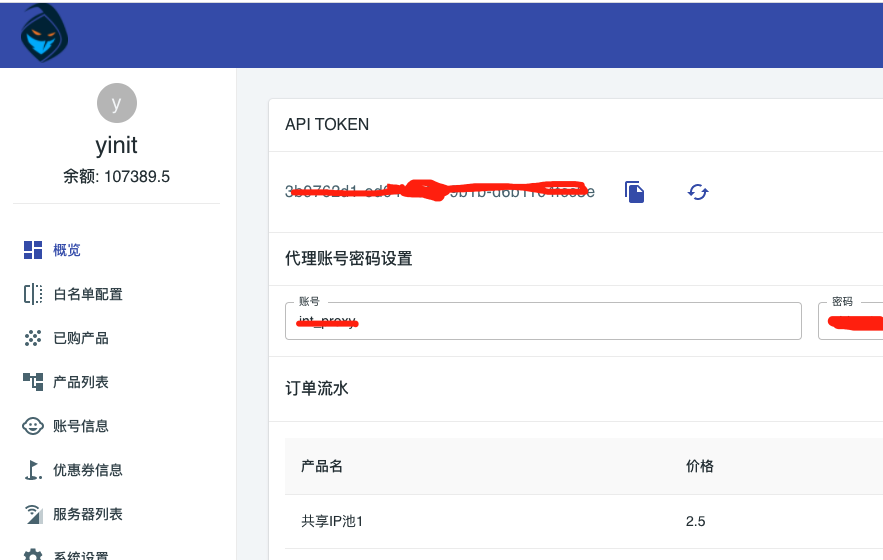

# API接口
后端操控的全套接口，都在swagger中描述: [swagger](/swagger-ui.html) ,同时malenia本身的后台网站，都是基于这一套api开发而来

- 了解权限问题：部分接口只能管理员可以访问
- 了解是否支持APIToken:对于支持APIToken的api，可以直接传递固定APIToken访问接口。否则需要调用登录接口的token刷新，获取动态token。动态token为了使得后端接口安全设计的。

##  APIToken
为了方便API调用，Malenia为每个账户提供了一个APIToken，malenia通过APIToken对api调用权限进行控制，你可以在后台概览面板中看到这个token.

如果您的token发生了泄漏，那么你可能需要修改token。此时点击上图的刷新按钮既可以实现token重建
**请注意，一旦token修改了，之前的token将会失效，请谨慎操作**

## 常见API

### [添加ip白名单](/swagger-ui.html#!/user45operator45controller/addWhiteIpUsingGET)
对于群控场景，白名单鉴权将会比密码鉴权更加通用。但是很多时候群控设备的出口ip会不停变动。此时可以通过api连续添加鉴权白名单.

- 白名单支持CIDR规则，如果你确定IP出口变化范围，更加建议采用CIDR规范
- 对于API自动添加的白名单，系统默认提供20个配置容量。超过20之后将会删除历时最早的api ip白名单，后台手动添加的白名单不受此规则影响。如果后台手动添加的白名单超过20个，那么API方式将无法成功加入白名单

### [删除白名单](/swagger-ui.html#!/user45operator45controller/deleteAuthWhiteIpUsingGET)
你可以删除特定的ip白名单

### [查询当前用户信息](/swagger-ui.html#!/user45info45controller/userInfoUsingGET)

通过这个接口可以获取到如下信息

- 账户名称
- 鉴权账户信息
- 余额
- ...

本接口如果通过api token调用，那么无法获取到用户密码信息。我们认为API是用在代码中，他是低优账户体系。后台账户将会对他保密

