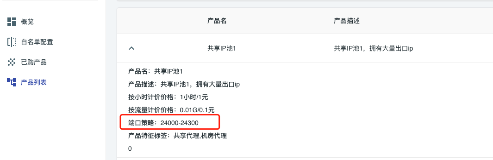

# 通用性说明

** 请注意，建议在pc上面查看demo文档，并且查看之前完成[malenia系统](/index.html)的登陆**

* [Java](./01_Java.md)
* [Python](./02_Python.md)
* [Go](./03_Go.md)
* [C#](./04_CSharp.md)
* [NodeJs](./05_NodeJs.md)
* [PHP](./06_PHP.md)
* [C++](./07_CPP.md)

## 代理服务器地址

代理服务器的地址为你当前访问的网站的host

| 访问网址                                 | 对应代理ip                    |
|--------------------------------------|---------------------------|
| ``http://haproxy.iinti.cn/xxx``      | ``haproxy.iinti.cn``      |
| ``http://malenia.iinti.cn/xxx``      | ``malenia.iinti.cn``      |
| ``http://haproxy-test.iinti.cn/xxx`` | ``haproxy-test.iinti.cn`` |

## 代理端口

端口取决于你订购的产品,在产品详情中有一个端口策略，从中选择任意一个端口都可以访问，如果端口策略存在多个端口，那么每个端口同一个时刻将会对应不不同的IP出口。
你可以通过选择不同的端口的方式来实现ip出口切换。

如果端口范围只有一个单一端口，那么说明当前产品只支持通过代理用户名策略实现ip出口切换。

## 账号密码

每个用户可以单独设置一个代理专用的账号密码，如果没有设置，那么您的后台登陆账号密码即作为鉴权账号密码。

**
再次声明，malenia的代理实现是按照代理协议标准实现的，如果有问题，可以在互联网搜索任何代理相关的资料**
