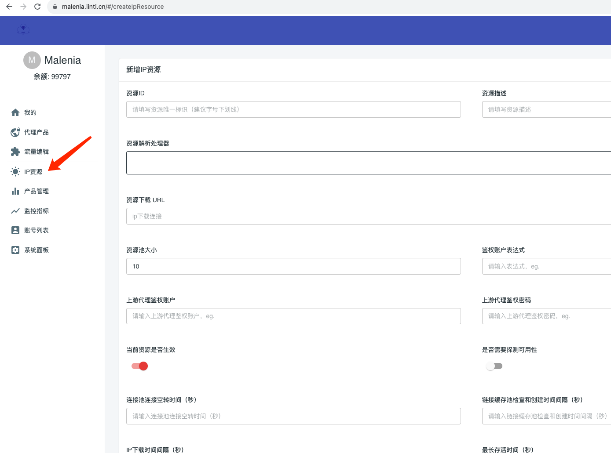

# 创建IP源

当系统完成安装之后，第一件事情就是考虑如何接入ip源，这里我们对ip源接入进行讲解

添加ip资源是一个相对比较复杂的任务,根据上图，我们逐一解释每个配置项的含义。在你没有足够指导的时候，你可以考虑联系我们的商务获得配置任务的帮助。

**同时在系统首次安装过程后，malenia默认会添加一个完整的上游IP资源配置(``embed_proxy``)
，以及为他创建对应的代理产品。用户可以参考这个默认的配置进行个人特有产品调整。**

## 资源名称

每个ip资源都需要有一个名称，名称建议使用英文+数字表示。汉字在这里是不被建议的

## 资源描述

随便描述下方便查找

## 资源池大小

非常重要，请您自行根据你对将要接入的ip的容量大小做一个评估。资源池大小是系统ip池在处理池化逻辑非常重要的参考，我们在考虑替换和下线ip的时候需要考虑ip池的总容量才能指定更加优异的ip切换方案。

需要注意的是，这个大小不是那些代理ip供应商宣传的每日ip几百万的概念，他只代理服务节点数。数量一般在几十到几百之间，只有大型互联网公司自己建立的代理ip网络才可能达到上千！！！

## 资源下载URL

资源下载URL的主要职责是获取上游代理ip供应商的代理ip列表。

- 有些代理ip供应商提供的是一个url，我们通过访问URL下载到代理ip资源。
- 有些代理ip供应商提供的是一个特定的ip+一个特定端口范围。此时不需要通过url下载

所以获取代理ip主要有两种方案，1通过url下载，2直接把配置发给客户。那么我们这里的资源下载URL字段就有两种配置，分别为静态URL和动态URL。

- 如果你的代理ip是需要通过url下载的，那么填入你的下载url即可
- 如果你的代理ip不需要通过url下载，而是固定的一个服务器和固定端口。那么按照规则填入这个服务器和端口即可。

## 上游代理鉴权账户 && 上游代理鉴权密码

供应商给你提供的账户密码，如果ip供应商是白名单ip鉴权，那么这里也可以不用填写。

## 是否需要探测可用性

如果开启，一个ip从ip供应商下载，导入到malenia系统之后，需要被malenia进行代理连通性测试之后才会被真的加入到ip池中。如果你对你的ip供应商质量足够自信，那么可以关闭这个开关。

## IP下载时间间隔（秒）

如果上游ip池提供的是ip列表，那么需要我们以一定频率的方式下载ip。正常情况这个数值应该是ip供应商供应的ip过期时间间隔的65%左右即可

## IP源支持协议

定义你的ip源所支持的代理协议,目前可以定义的为：HTTP、HTTPS、SOCKS5。在实际采购代理IP池时，请尽量选择支持Socks5的代理IP池，
这是因为Malenia系统支持协议转换，Http/Https代理协议可以运行在Socks5之上，反之只支持http协议的代理无法转换为Socks5。

- 如果您采购了只支持http协议的代理IP池，那么最终给用户提供的代理产品，则仅能支持http
- 如果您采购了只支持socks5的代理IP池，那么最终给用户提供的代理产品，则可以同时支持http、https、socks5

*在maleniav2版本中，我们删除了关于socks4协议的支持，这是因为实际生产并没有发现socks4的使用场景，如果您的业务确实需要，请联系我们商务进行沟通*

## 最长存活时间（秒）

ip供应商告诉你的ip切换时间，如果你是长效IP，可以设置为一个很长的数，并且对于长效如果最长存活时间小于IP下载时间间隔，那么ip约等于永久有效

 

