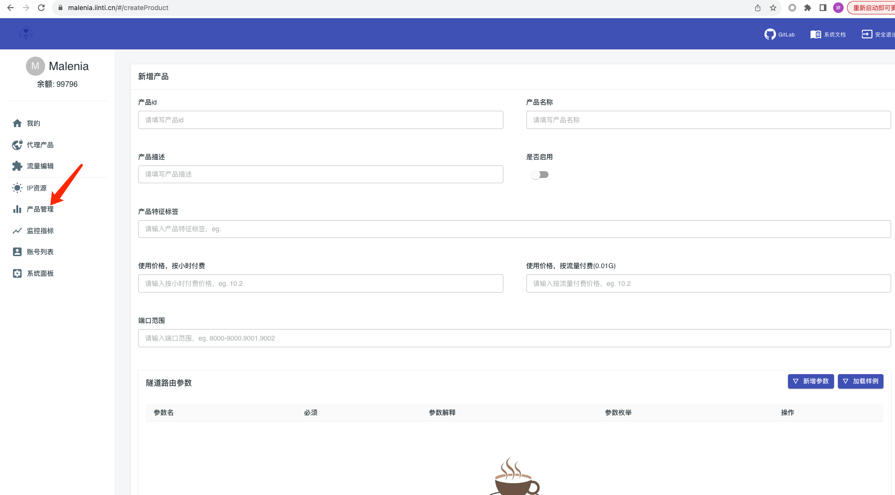
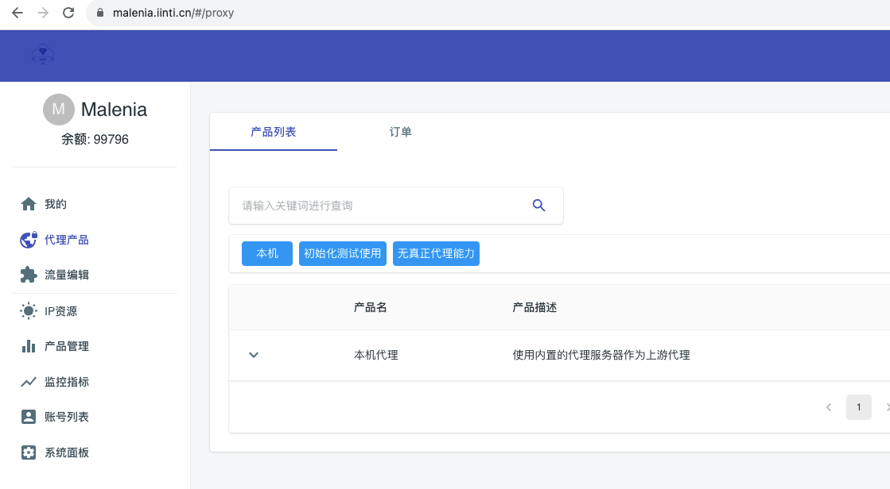
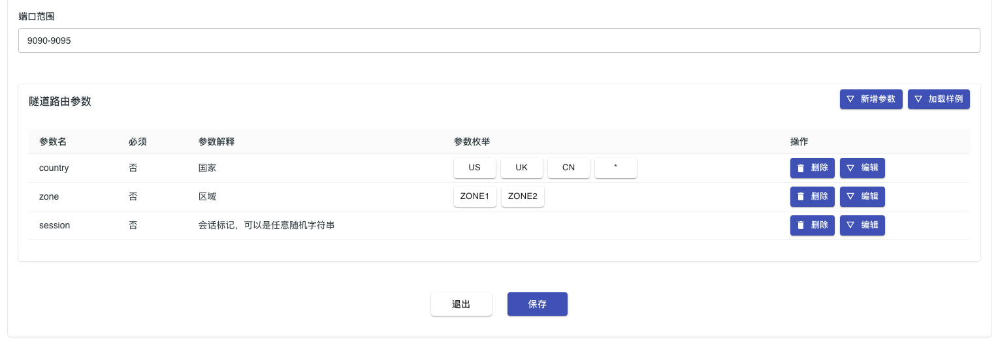
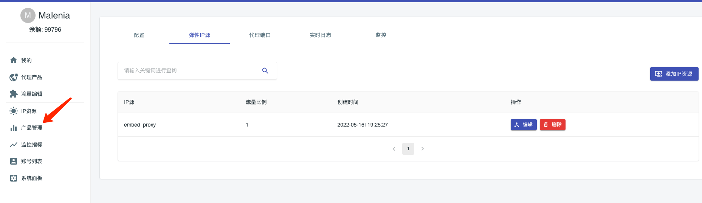
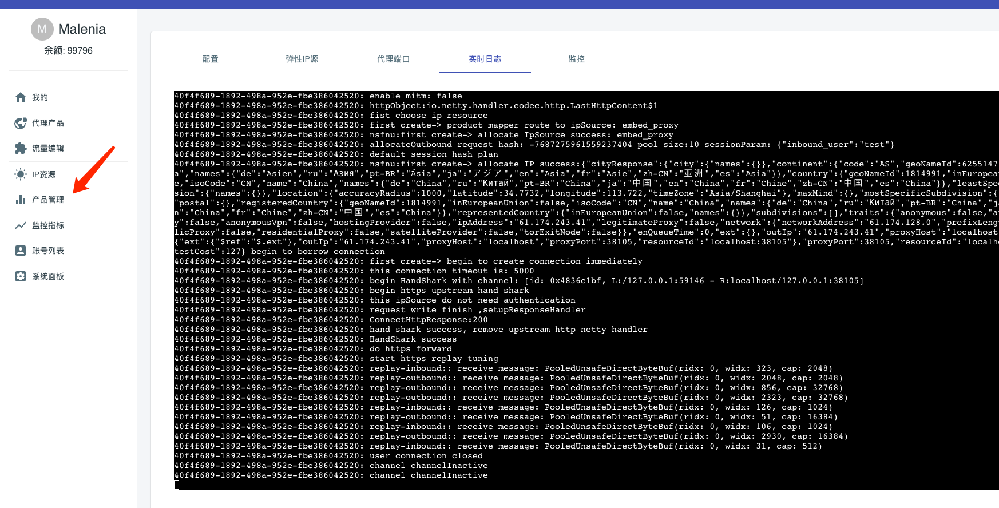
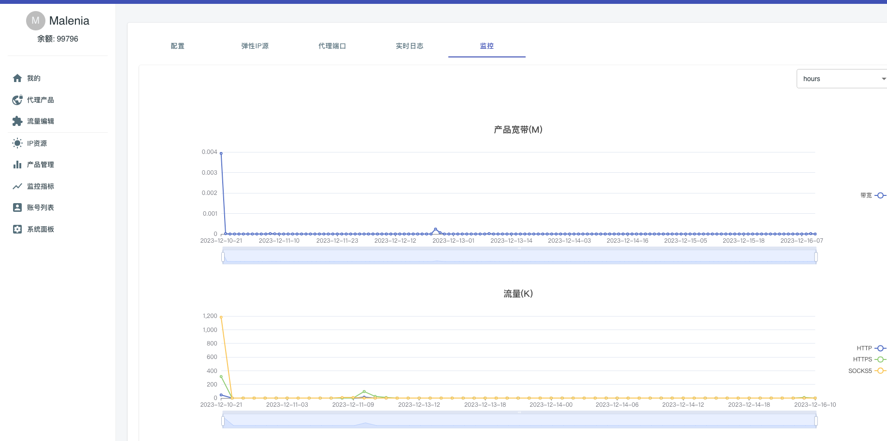

# 产品配置

代理产品是我们系统定义如何让客户使用代理资源，他的本质就是开启一批代理服务，并且对这个代理服务规定价格、产品特征、服务启用端口范围等。

管理员可以在[产品列表页面](/index.html#/product)进行代理产品添加

## 产品名称 & 产品描述
给你想要开启的代理服务起个名字，方便检索

## 产品特征标签
特征标签是给产品创建的搜索标签，逗号分割了多个标签。标签的作用主要是在用户选择产品的，通过标签快速搜索。在创建产品的时候，需要尽可能创建一些符合本产品特征的标签。

## 端口范围
端口范围是当初产品开放代理服务的监听端口。可以有如下多种写法

- 单个数字:22225
- 数字空间范围:22225-22325
- 多个数字:22225,22226,22227
- 多个数字，或者多个范围: 22225,22227-22325

malenia以端口区分产品，每个产品可以工作在多个不同的端口上。使用代理的时候，端口指定端口范围的端口的时候即可。
在你创建malenia产品的时候，可能选定的端口已经被其他产品占用了。此时malenia系统会检测到占用情况，从而让你产品创建失败。

如果你的产品绑定了多个端口，那么不同端口会映射到不同session，这样每个端口同一个时刻将会有不同的出口ip。然后同一个端口的ip连续一段时间(一般情况大约4分钟)出口ip将会固定。

## 定价

需要同时提供两个定价方案（都为必填字段），用户订购产品的时候，将会选择其中一个定价方案进行扣费。

- 按小时付费: 小时付费价格，每个小时进行一次扣费
- 按流量付费：按量付费价格，单位为0.01G

## 隧道路由参数

隧道路由参数定义了通过账号传递参数控制单个代理请求行为，此模块负责定义本产品支持的隧道路由参数，你可以通过``加载样例``功能得到一个demo的配置，然后在demo基础之上进行修改。

- 参数名不能使用保留符号``-``
- 可以标记本参数是否可以为空
- 可以给出参数的解释性说明，
- 可以设置参数可选的枚举内容

**请注意： 如果您的产品内部挂载多个IP池，则需要考虑每个ip池是否都能正确处理这里定义的隧道路由参数，即多个IP源提供同等能力**

**请注意： 在本页面定义的隧道路由参数只是相关字段定义，用于渲染给最终用户，字段的使用在``Ip源``的用户鉴权表达式章节进行定义**

## 关联产品和ip源

ip源是我们定义如何接入上游ip资源，代理产品是我们定义如何开放代理服务。那么现在我们只需要把ip源绑定到代理产品上，即可完成代理服务能力和上游ip资源转发的任务。
我们支持任意的代理产品根据需要路由到任意的IP源，这个绑定关系是我们后台控制的,如下图所示。

在产品的操作页面，你可以绑定产品将要路由的IP源，并且可以指定他们的流量比例

## 日志和监控
在产品的详情页面，可以看到实时的产品全链路日志，以及看到和本产品相关的监控。

