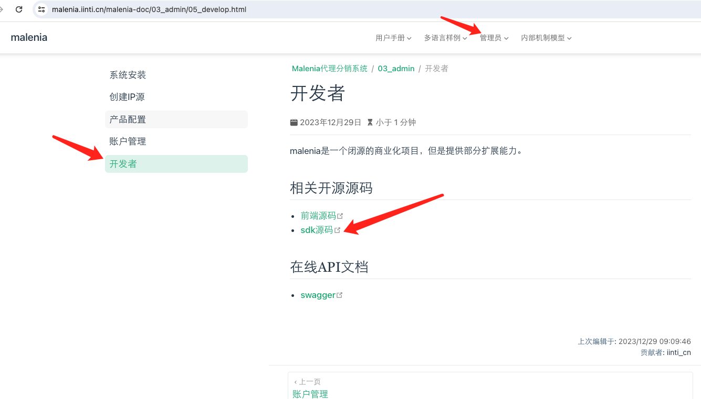
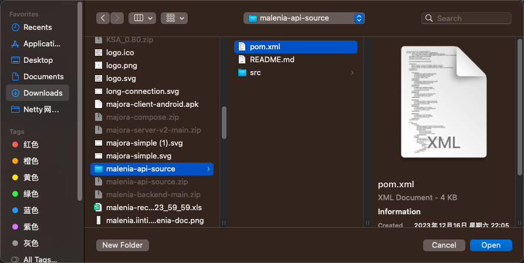
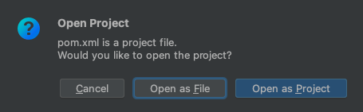
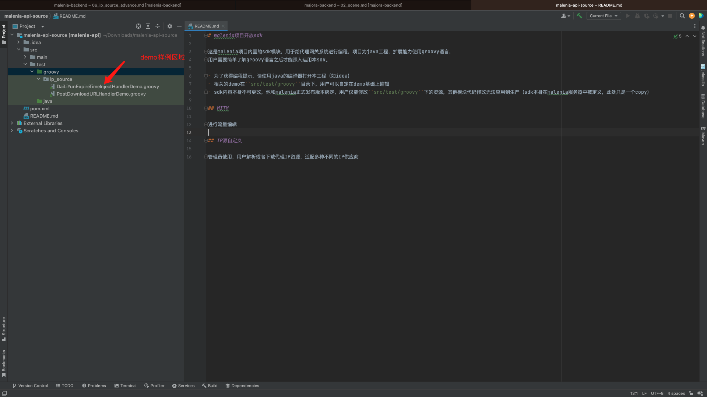

# IP源高级

这里讲解高级配置，对于大部分用户来说，此章节可能是不需了解的。直到某些特殊的需求无法被满足，则可能需要高级配置项来完成

## 使用代码脚本

malenia大部分IP源配置使用前端页面完成参数配置，前端配置完成绝大部分通用场景，代码脚本进行定制化。

- IP资源入库结构非标准的IpPortPlain和PortSpace
- IP资源是单一的host:port
- IP资源入库后无法立即使用，需要等待一段时间
- 和malenia一样，上游IP供应商提供的是基于用户名域扩展的参数隧道控制体制，如luminati和大部分海外IP资源供应商
- 需要精确控制每个IP资源的账户、密码、过期时间等
- 需要对接IP资源上下线情况，如统计IP使用情况，并发送统计数据到外部系统

### 获取脚本

请在文档-》管理员-》开发者-》sdk源码 下载脚本sdk环境



请使用[idea](https://www.jetbrains.com.cn/idea/)软件打开解压后的sdk源码




打开后工作环境如下图



### 脚本语法基础

- 脚本使用groovy语法，属于java语言的一个扩展，你可以完成把它当作java来写，也可以调用一切java的API。
- 所有脚本包含``@BaseScript GroovyIpResourceHandler _base``这一句代码，这样编译器软件可以提供代码检查和语法提示

### 相关demo

#### demo-使用自定义的parse方法

```groovy
import cn.iinti.malenia2.api.resource.GroovyIpResourceHandler
import com.google.common.base.Splitter
import groovy.transform.BaseScript

/**
 * 此行代码可以让编译器：idea 提供代码提示，语法检查等功能。
 * 如果您在idea中编辑脚本，建议保留此行
 */
@BaseScript GroovyIpResourceHandler _base


/**
 * 正常情况malenia不需要直到代理ip的过期时间，但是如果某些特殊的场景需要设定ip过期时间，
 * 则参考本事例，设置过期时间:expireTime
 */

parse {
    // content格式
    // "183.165.128.141:57114,183.165.128.141,中国-安徽-淮南--电信,1650093710,1650094010\n" +
    // "183.165.128.141:57114,183.165.128.141,中国-安徽-淮南--电信,1650093710,1650094010"
    //
    content.toString().split("\n").split {
        addProxyIp {
            def strings = Splitter.on(",").splitToList(it.toString())
            def hostPort = strings.get(0).split(":");
            proxyHost = hostPort[0]
            proxyPort = Integer.parseInt(hostPort[1])
            // 请注意，如果你在代理资源整体配置过账户密码，那么这里可以不用为单个代理资源陪配置密码
            setUserName null
            setPassword null
            expireTime = Long.parseLong(strings.get(3))
        }
    }
}
```

#### demo-IP源使用post方法获取内容

```groovy

import cn.iinti.malenia2.api.resource.GroovyIpResourceHandler
import com.alibaba.fastjson.JSONArray
import com.alibaba.fastjson.JSONObject
import groovy.transform.BaseScript

@BaseScript GroovyIpResourceHandler _base


/**
 * 绝大部分IP下载连接是GET 的URL，
 * 如果遇到需要是POST的，则参考本demo
 * 如：{link https://goipstar.com/docs/#api-Basic-GetNewIpList}
 */

TreeMap<Long, JSONArray> cache = new TreeMap<>();

parse {
    api.http.addHeader("X-TOKEN", "xxxxx-请修改这里")

    def response = api.http.post("https://www.goipstar.com/api/getNewIpList", [
            'num'     : '50',
            'username': 'malenia_user_001',
            'password': 'malenia_pass_001'
    ])
    if (response != null) {
        cache.put(System.currentTimeMillis(), JSONObject.parseObject(response).getJSONArray("data"));
    }

    def firstEntry = cache.firstEntry()
    if (System.currentTimeMillis() - firstEntry.key > 120_000) {
        cache.remove(firstEntry.key)

        firstEntry.value.each {
            def item = it as JSONObject
            addProxyIp {
                proxyHost = item.getString("host")
                proxyPort = item.getInteger("port")
                userName = "malenia_user_001"
                password = "malenia_pass_001"
            }
        }
    }

}
```

#### demo-构建支持隧道参数透传的IP源

```groovy
import cn.iinti.malenia2.api.resource.GroovyIpResourceHandler
import groovy.transform.BaseScript
import org.apache.commons.lang3.StringUtils

/**
 * 此行代码可以让编译器：idea 提供代码提示，语法检查等功能。
 * 如果您在idea中编辑脚本，建议保留此行
 */
@BaseScript GroovyIpResourceHandler _base


buildUpStreamUser {
    // 获取用户zone参数，并使用zone1兜底
    def zone = StringUtils.defaultString(getSessionParam("zone"), "zone1")
    // 获取用户country参数，并使用us兜底
    def country = StringUtils.defaultString(getSessionParam("country"), "us")
    // malenia为所有用户创建了sessionId
    def session = sessionId

    // 上游用户使用用户名指定隧道参数：即通过用户名控制国家/地区/运营商等
    userName "${inboundUser}-zone-${zone}-country-${country}-session-${session}"

    // 上游用户使用密码指定隧道参数：即通过用户名控制国家/地区/运营商等
    password "${inboundUser}-zone-${zone}-country-${country}-session-${session}"
}
```

#### demo-使用malenia来决策内置的session

```groovy
import cn.iinti.malenia2.api.resource.GroovyIpResourceHandler
import groovy.transform.BaseScript

@BaseScript GroovyIpResourceHandler _base
// 此机制保持50个session，分化50个IP资源到malenia系统
parse {
    for (int i = 0; i < 50; i++) {
        addProxyIp {
            resourceId = "proxy_" + i
            proxyHost = "zproxy.lum-superproxy.io"
            proxyPort = 22225
            userName = "lum-customer-c_9a85388b-zone-zone1-country-us-session_" + i
            password = "qtsqyds26lse"
        }
    }
}
```

### demo-单一隧道ip池化

对于上游隧道ip场景，供应商只会提供一个ip:port二元组，这导致malenia系统入库只有一个ip资源。实际上单一ip资源在池化系统很难决策，
因为池中一个唯一的ip，很难判断健康状态，以及很难决策是不是应该remove。当状态bad时，remove导致整个池空，不remove则ip质量差。

为解决这个问题，我们需要对单一ip进行影子分身，也即一个ip复制成多个，malenia把它当作多个ip资源进行独立的生命周期管理。

类似如下代码，对于luminati隧道代理，配置10个ip大小的ip池，同时对同一个luminati的上游配置创建20个复制。则malenia认为是20个独立的ip入库，
之后某个ip随机抖动仅会影响局部。除非整体使用质量都非常差，否则单一ip质量问题不会导致ip池健康状态抖动

```groovy
import cn.iinti.malenia2.api.resource.GroovyIpResourceHandler
import groovy.transform.BaseScript

/**
 * 此行代码可以让编译器：idea 提供代码提示，语法检查等功能。
 * 如果您在idea中编辑脚本，建议保留此行
 */
@BaseScript GroovyIpResourceHandler _base


parse {
    for (i in 0..<20) {
        addProxyIp {
            resourceId = ("proxy_" + i)
            proxyHost = "brd.superproxy.io"
            proxyPort = 22225
            userName "brd-customer-hl_25455sadf-zone-static"
            password "adfas444"
        }
    }
}
```