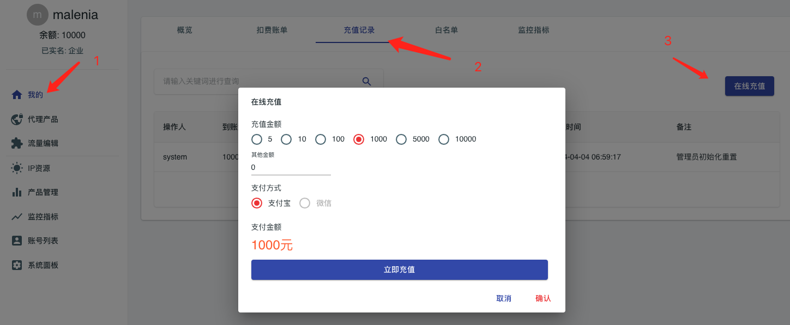

# 支持在线充值
如果你使用malenia系统进行代理ip资源销售，则可以开启在线充值功能。这样可以在无人工干预情况下自动完成销售业务流程。

## 前置条件
malenia在线充值目前仅为中国大陆适配，即满足如下条件

- 仅支持支付宝/微信两种在线支付方式
- 若c端用户需要充值，则要求必须完成实名认证

## 实名认证
实名认证包括两种认证方式：个人认证/企业认证，
malenia使用支付宝的API完成实名认证，您需要提前获得支付宝API的授权码

- 个人认证： [https://market.aliyun.com/products/57000002/cmapi022049.html](https://market.aliyun.com/products/57000002/cmapi022049.html)
- 企业认证： [https://market.aliyun.com/products/56928005/cmapi00064074.html](https://market.aliyun.com/products/56928005/cmapi00064074.html)

*你需要同时配置个人认证和企业认证两个通道，才能激活malenia的实名认证功能（如果只配置某一种认证方式，无法激活）*

在``conf/application.properties``中配置如下内容，即开启实名认证功能
```properties
# 个人认证AppCode
env.certification.personal.appcode=6be228852c1e4866af7bb845affdc9ee
# 企业认证AppCode
env.certification.enterprise.appcode=a07621b8e2a9460bace7611cae43f33e
```

## 在线充值
对于完成实名认证的用户，可以通过支付宝或者微信进行在线充值,用户在《我的》-> 《充值记录》->《在线充值》调出充值页面



和实名认证不同的是，配置支付宝，微信中任意通道，均可开启在线充值功能，malenia系统将会自动完成支付通道支持能力的判断，并且在UI交互方面做好页面逻辑。

### 支付宝在线充值
在``conf/application.properties``中配置如下内容，即开启支付宝支付供功能

更多相关资料，参见支付宝官方：[支付宝电脑网站支付快速接入](https://opendocs.alipay.com/open/270/105899/)
```properties
# 支付宝公钥
env.pay.ali.keyPublic=MIIBIjANBgkqhkiG9w0BAQEFAAOCAQ8AMIIBCgKCAQEAijg8SecniS4lSDpG6HZYycTh+mke8kyDJcPdOvGzJ...
# 应用id
env.pay.ali.appId=9021000134622222
# 应用私钥
env.pay.ali.keyPrivate=MIIEvAIBADANBgkqhkiG9w0BAQEFAASCBKYwggSiAgEAAoIBAQCaFmVJPprKC/eVQNzYd7vG0BZT5k17EzlmW...
```

### 微信在线充值
在``conf/application.properties``中配置如下内容，即开启微信支付供功能

更多相关资料，参见微信官方：

- [支付宝Native支付开发指引](https://pay.weixin.qq.com/wiki/doc/apiv3/open/pay/chapter2_7_2.shtml)
- [githubSDK](https://github.com/wechatpay-apiv3/wechatpay-java)

```properties
#商户号
env.pay.wechat.merchantId=1900009191
#商户API证书的证书序列号
env.pay.wechat.merchantSerialNumber=9021000134622222
env.pay.wechat.appId=wxd678efh567hg6787
#商户API私钥
env.pay.wechat.keyPrivate=MIIEvAIBADANBgkqhkiG9w0BAQEFAASCBKYwggSiAgEAAoIBAQCaFmVJPprKC
env.pay.wechat.apiV3Key=...
```
