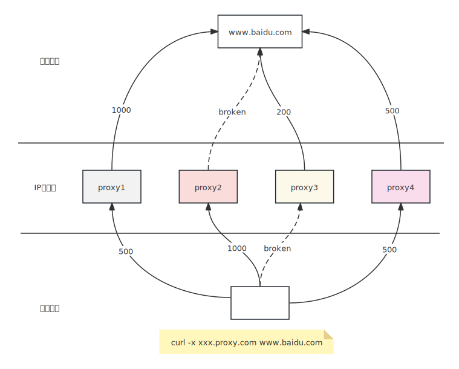
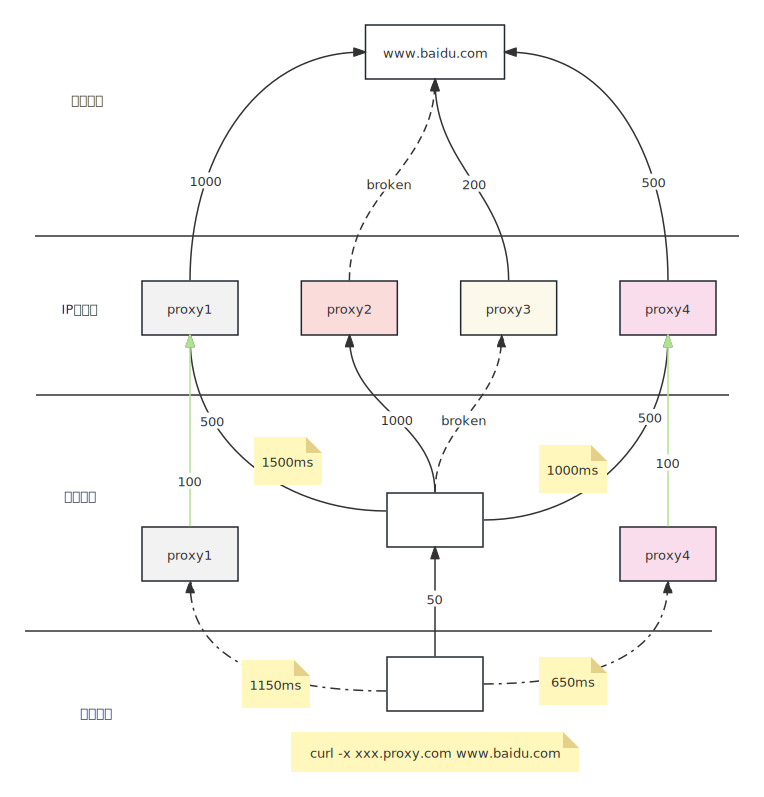

# 池化加速
代理IP池分为提取型IP池和隧道型IP池。国内大多数IP池是提取型IP池，具体表现代理服务器节点拨号获得IP，上报心跳注册到IP池管理中心，业务直连代理服务器本身。

**一般情况下，业务直连代理服务器肯定比中间加一层转发更快**，然而此中业务模型存在如下缺陷。

- IP节点依靠心跳和重播管理器注册保持存活，业务使用时实际可能无法联通，如下图``proxy2``
- 受限于ISP规则，代理节点可能存在多种联通性可能。
  - 代理节点机器存活，并且注册到IP池，但是业务机器和代理节点网络不通
  - 代理节点存活，但是代理节点和目标网站(``www.baidu.com``)网络不通
- 受限于物理区域，IPS线路不同，代理存在多种速度可能，如下图``proxy1``和``proxy4``
  - 以业务机器为中心，代理节点距离业务机器有多种物理远近、ISP线路区分
  - 以目标网站(``www.baidu.com``)为中心，代理节点和目标网站有物理远近、ISP线路区分
- 代理节点至少是分布在全国的跨区域、跨机房通信，业务机器通信成本一般在500毫秒区间（单机房机器通信则在50毫秒成本）

## 机房起点中心探测
由于代理节点的物理拓扑和ISP线路，业务+代理节点+目标网站三元组的线路性能是不确定的， 部署代理网关作为代理IP池中间层，则以业务机房为网络起点，对多个代理节点的线路进行探测，
此时可以得到如下两个优化结果

- 探测结果以业务机房为起点，验证业务到代理节点的网络联通可达性，崩坏代理ip节点不会上线到业务
- 探测结果以业务机房为起点，业务机房为终点（目标网站为业务本身），验证所有IP资源的访问速度，尽可能保证生产环境IP资源是相对业务机房自身优质
  - 以访问速度排序进入IP池
  - 尾部访问较慢IP自动进入备用候选池，除非可用IP池资源崩坏，否则不使用质量较差的IP资源

机房起点终点探测机制，保证代理网关从IP池资源中获得的是可用的，并且尽可能优质的IP资源。此资源是业务所在机房的物理点位出发，获得的是属于适合您公司所在机房性能最好的IP资源排序

## tcp连接池
从代理IP使用角度出发，代理请求区分如下三个步骤。
- tcp连接：三次握手，创建到代理服务器的连接，平均耗时：500ms
- 代理隧道建立：鉴权和代理服务器tcp，平均耗时：500ms
- 业务流量负载：发送业务的http请求，接收业务http response： 平均耗时500ms

目前所有的http网络库，都不是专门为爬虫场景设计的，其协议交互过程都是完全走完上述3个阶段，所以网络库直连代理节点其实有比较大的性能损耗。
实际上在代理网关的接入下，我们有足够的机制可以优化代理请求速度。

- 业务机器一旦和代理网关部署在相同机房，则业务机器的http网络库到代理网关的时间成本是 平均：50ms
- 代理网关将会根据业务的流量情况，提前创建到代理节点的tcp连接，完成tcp第一阶段的三次握手。（入命中连接池，则时间成本为减少450ms，即原来500ms，变成到同机房代理网关的50ms）
- 代理网关可以根据业务流量情况，提前创建到目标网站的隧道（也完成代理鉴权过程）**本机制目前malenia还没有实现，此功能在roadmap中**
- 代理网关在遇到IP连接失败时，将会默认业务进行请求重试，并且网关的重试更有效率
  - 代理网关使用异步多路机制并行创建连接，目前策略为同时使用3个IP资源进行隧道建立，这使得重试过程更加有效（业务重试是一个一个的重试，并且每次都需要重新申请IP，使用IP，耗时非常长）
  - 代理网关将会缓存重复创建的溢出连接资源，给其他业务使用。即虽然同时测试3个IP资源，假定三个都成功，则其中一个给业务使用，另外两个连接则缓存给后续业务使用，减少资源浪费
  - 代理网关的重试具备记忆功能，重试成功的IP将会被网关记住，下一次业务请求将会使用相同的IP资源

**这里需要注意的是，malenia的重试机制，发生在代理请求三个步骤的第一步、第二步，即业务负载发送之前，故此机制保证重试不会带来状态一致性问题。所以malenia的重试机制内置模型（不影响http sdk、不影响业务流程、业务使用无感知）**

