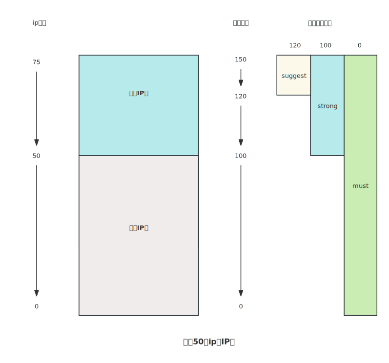

# 健康评估

对于IP网关来说，malenia是一个中间件，所有工作仅能在代理协议规定的范围内操作。由于不能侵入到业务本身，也不能获得上游IP供应商的准确信息，所以评估业务在IP池上的运作健康状态是非常困难的。

- 如何判断失败是业务问题还是代理IP本身问题，如下场景：
  - 在国内有人使用代理IP访问Google，则访问必然失败，此问题是业务本身问题
  - 代理过期后，上游供应商返回403，此问题是上游供应商问题
  - 代理IP被风控，代理请求被风控等业务问题导致http响应403，此问题是业务问题
  - 由于代理节点本身负载过高，或者网络通畅性问题导致的代理连接超时，此问题是代理节点问题
  - 由于代理服务器本身机器的负载过高，或者带宽过高导致代理连接超时，此问题是代理网关问题
  - 目标网站自身负载过高，导致代理连接超时，此问题是目标网站问题
- 发现问题后，如何决策，什么场景应该下线IP，什么场景应该继续使用
  - 如果发现问题则立即下线对应节点，则高并发情况下存在多种误判，则会导致IP池瞬间被跑空（如有人使用代理网关访问不可达网站，例如Google）
  - 如过不下线IP节点，则可能有崩坏代理节点一直在业务中，引起业务整体服务质量降低

## 健康状态一维化
首先解决第一个问题，如何量化IP资源的健康状态，即通过IP使用情况的一些表征来评估每个节点的质量、全盘IP池的整体质量。
因为确定健康状态量化规则后，才可以明确得到当前IP池的整体情况，为后续IP失败下线决策做参考依据。

malenia提供的量化指标叫做健康指数，如下图：

考虑IP节点崩坏，底层动作一定发出某种强度下线崩坏IP节点的信号，则一定会带来IP池中IP节点下线，所以从理论上来说，IP池中剩余IP数量的大小，则可以代表IP池健康指数了。
- 如果每个IP都好用，没有发出任何IP下线指令，则IP池处于满池溢出状态
- 如果每个IP都不好用，则一定会不断发出IP下线质量，则IP池处于最低IP数量状态。

malenia要求创建IP资源的时候，指定一个IP池容量，此容量非常关键，健康状态以此容量作为基础评估IP健康指标。malenia的IP池划分为两个区域：

- 可用IP区，代理节点入库后，探测有效且速度快的IP资源进入可用IP区，可用IP区的代理节点上线给业务服务，将会有自己的连接池、资源使用统计情况等运行时数据
- 备用IP区，代理节点入库过程如果可用IP区满，则溢出到备用IP区域。 可用IP区节点被踢出后将会从备用IP区挑选节点补充到可用IP区
- 备用IP区的入库顺序根据最近入库、探测最快速度排序，使得最新的，质量最好的IP资源在头部。
- 备用IP区容量不能超过设定IP池大小，超过后将会移除尾部资源（避免一直入库但是IP不下线，导致备用IP资源成为大队列）

### 健康分数
所有IP节点数量/设定预期IP池化容量=健康分数，其中所有IP节点数量包括可用IP区+备用ip区的所有节点。

如上图事例，设定IP池容量为50，则当50个IP入库后，本IP池的健康指数为100，再入库25个IP到备用IP区后，则健康指数为150。假定所有IP均不可用，IP池中IP数量为0，则对应健康指数为0。

### 健康分数三段位
完成对IP池IP质量量化任务后，为了避免动态策略配置复杂，我认为的为健康分数划分了三个等级，用于后续下线节点指令的决策。

- \>120：优，此时IP池具备充足的IP节点，业务轻微反馈IP节点不好用即可下线对应节点，处理suggest下线级别
- \>120> 100：良,此时IP池有部分备用IP节点，但是IP数量快要接近用户设定IP容量，此时只有业务强烈怀疑IP资源出现故障才会下线节点（虽然是强烈怀疑，但是也只是怀疑，所以可能有误判），处理strong下线级别
- \>100>0： 差，此时IP池已经低于用户设定IP容量，判断IP池已经处于不健康状态，此时如果没有必要不进行IP资源下线，除非明确判断IP资源崩坏，处理must下线级别

## IP下线指令
malenia框架在运行过程中，通过对IP资源使用的拦截，可以获得节点可靠性信息反馈，并且每当节点使用异常发生，便会产生下线指令。
受限于两个原因，IP下线指令具备指令强度区分

- 拦截信息可能不准确，具备误判的可能，此时只能出发建议下线级别的指令，如接收到5xx，4xx，测试可能是业务本身存在的故障，而非代理链路故障
- 当malenia本身跑慢带宽，或者malenia本身处于高负载状态情况下，框架接收到的错误来自代理网关机器本身，和代理节点无关

### 下线指令强度

- must: 代理服务器拒绝连接、代理网关到代理服务器NETWORK_UNREACHABLE。代理节点崩坏给出的明确结论
- strong：代理服务器连接超时。大多数IP节点崩坏的表现，如代理服务器自身故障导致监听端口不处理请求、链路上防火墙阻断访问、VPS所属机房下线IP默认策略、代理服务器负载高导致连接处理不及时等。
- suggest: 代理服务器返回: NETWORK_UNREACHABLE、代理服务器返回异常的http状态码，如5xx，4xx，以及其他异常情况
